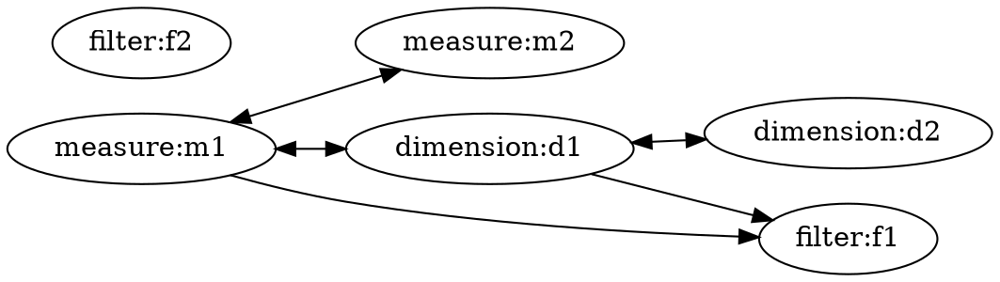

아 아주 핵심 포인트를 정확하게 집어줬어👍
너가 말한 것처럼:

만약 입력된 selectedMeasures나 selectedDimensions끼리 전혀 연결되어 있지 않다면,

이는 그냥 “조건에 맞지 않는 조합”이라는 의미지.

이거는 "isJoinable" 같은 별도의 함수를 만들어서 확인할 수 있다고 생각해.

🔹아이디어 (isJoinable) private boolean isJoinable(Set<String> selectedMeasureKeys, Set<String> selectedDimensionKeys) { for (String measureKey : selectedMeasureKeys) { FieldConfig measure = fieldConfigMap.get(measureKey); if (measure == null) continue; List<JoinConfig> joins = getJoinTargets(measure, REPORT_DIMENSION); for (JoinConfig j : joins) { if (selectedDimensionKeys.contains(j.getTarget())) { return true; // 하나라도 연결되어 있으면 true } } } return false; } 🔹사용 if (!isJoinable(selectedMeasureKeys, selectedDimensionKeys)) { throw new IllegalArgumentException("조건에 맞지 않는 measure-dimension 조합입니다."); } 🔹확장 (M-M이나 D-D의 연결 확인) 

동일하게

private boolean isMeasurePairJoinable(Set<String> selectedMeasureKeys) { … } private boolean isDimensionPairJoinable(Set<String> selectedDimensionKeys) { … } 

처럼 구현할 수 있어.

🔹추가 고려 (Generalized) 

만약 한 가지 기능으로 풀려고 하면:

private boolean isJoinable(Set<String> fromKeys, Set<String> toKeys, String fromType, String toType) { for (String fromKey : fromKeys) { FieldConfig from = fieldConfigMap.get(fromKey); if (from == null) continue; List<JoinConfig> joins = getJoinTargets(from, toType); for (JoinConfig j : joins) { if (toKeys.contains(j.getTarget())) { return true; } } } return false; } 🔹정리: 

✅ isJoinable 함수를 만들어서 선택된 IDs끼리 연결되어 있는지 확인할 수 있다.

✅ 만약 연결되어 있지 않다면 Exception이나 오류 메시지를 발생시켜서
사용자가 "조건에 맞지 않는 조합"이라는 것을 인지하게 만들면 된다.

만약 해당 기능과 Exception Handling 까지 포함해서 한꺼번에 리팩토링하거나
너의 getJoinRecommendations 내부에서 자연스러운 흐름으로 넣고싶다면 또 알려줘! 🌟


----

좋은 질문이야! `m → f` 같은 \*\*단방향 관계(measure → filter)\*\*를 **혼합 방향 그래프** 안에 명확히 표현하려면, **간선에 방향성을 표시**하고, **filter는 종착지**라는 걸 시각적으로 구분해줘야 해.

---

## 🔁 방향성 그래프에서 `m → f` 표현 방식

### 🔹 텍스트 그래프 표현 (with direction)

```
measure:m1 ────▶ filter:f1
```

### 🔹 전체 구조 안에서의 표현:

```
                ↕
        measure:m1 ←→ measure:m2
             │   ▲
             ▼   │
      dimension:d1 ←→ dimension:d2
             │
             ▼
         filter:f1
```

이때:

* `→` 는 단방향 (`JoinConfig`에서만 존재)
* `↔` 는 양방향 (`measure`, `dimension` 관계에서 상호 `JoinConfig`가 존재하거나 특별히 허용된 경우)

---

## 🔹 DOT (Graphviz) 포맷 예시



이렇게 하면 시각화 시:

* `m1 → f1`, `d1 → f1`은 단방향 화살표로 나타남
* `m1 ↔ m2`, `m1 ↔ d1`, `d1 ↔ d2`는 양방향 화살표로 나타남

---

## 📌 결론: `m → f` 표현은

* **단방향 간선**으로 표현 (텍스트든, 그래프 시각화든)
* `filter`는 항상 **화살표의 도착지점 (sink)** 로 표현
* 위상적으로 보면 **중앙에 measure/dimension**, 아래쪽에 **filter**가 위치한 형태가 직관적

필요하면 이걸 기반으로 시각화 도식 이미지도 그려줄 수 있어!


Absolutely! Here’s the **English version** of the full explanation and analysis of your `JoinGraphHelper#getJoinRecommendations` logic, with **pseudocode**, **diagram-style explanations**, and **graph algorithm associations** — suitable for presentation use:

---

## 🔍 Overview: What does `getJoinRecommendations` do?

This method takes the following inputs:

* `Set<CategoryFieldKey> selectedMeasures`
* `Set<CategoryFieldKey> selectedDimensions`
* `Set<CategoryFieldKey> selectedFilters`

And returns recommended fields:

* `List<JoinFieldInfo> measure`
* `List<JoinFieldInfo> dimension`
* `List<JoinFieldInfo> filter`

Recommendations are based on **predefined join relationships** in a field config map (`Map<String, FieldConfig>`).

---

## 🔁 Flow Summary (Flowchart Style)

```plaintext
   ┌───────────────┐
   │ Input: M/D/F  │
   └──────┬────────┘
          ▼
 ┌──────────────────────┐
 │ MEASURE logic        │
 │ - Find D intersection│
 │ - Gather filters (∪) │
 │ - Recommend related M│
 └──────┬───────────────┘
        ▼
 ┌────────────────────────┐
 │ DIMENSION logic        │
 │ - Recommend related M  │
 │ - Dimension intersection│
 │ - Gather filters (∪)   │
 └──────┬─────────────────┘
        ▼
 ┌────────────────────────┐
 │ FILTER logic           │
 │ - From M/D ➝ F edges   │
 └────────────────────────┘
```

---

## 🧠 Deep Dive by Logic Block

### 1. **MEASURE Block**

* If no measures are selected → **recommend all**.
* If measures are selected:

  * For each selected measure:

    * Collect `dimension` targets.
    * Compute **intersection** across all selected measures.
    * Collect `filter` targets (union).
  * Recommend compatible measures that:

    * Have **bidirectional join** relationships.
    * Have **unit compatibility** (e.g., same currency or metric type).

> 🔗 **Graph analogy**:
> Each measure is a node, connected to dimension/filter nodes. Intersection and union calculations are like graph set operations on neighbors.

---

### 2. **DIMENSION Block**

* If dimensions are selected:

  * Collect related **measures** and **filters**.
  * Compute **intersection of joinable dimensions**.
  * Recommend unselected related measures and dimensions.

> 🔗 **Graph analogy**:
> For each selected dimension node, traverse outgoing edges to measure/filter/dimension nodes. Then perform intersection for dimension and union for filters.

---

### 3. **FILTER Block**

* Collect all filters reachable from selected measures/dimensions.
* Recommend those not already selected.

> 🔗 **Graph analogy**:
> Simple BFS traversal from M/D nodes to F nodes. No deep chaining required.

---

## 🧮 Key Supporting Functions

| Function                                | Role                                                                                |
| --------------------------------------- | ----------------------------------------------------------------------------------- |
| `getFieldConfig(key)`                   | Retrieves the field’s metadata                                                      |
| `getJoinTargets(field, group)`          | Gets list of join targets of a field for a given group (measure, dimension, filter) |
| `isMeasureJoinRelated(a, b)`            | Checks if two measures are joined (either direction)                                |
| `isCompatibleUnit(candidate, selected)` | Checks unit compatibility for measures                                              |
| `getAllFieldKeys(group)`                | Returns all known keys for a group                                                  |
| `toFullKey(group, key)`                 | Encodes a unique string key for a field                                             |
| `fromFullKey(string)`                   | Parses a key string back into field info                                            |

---

## 🧾 Pseudocode (Measure logic example)

```pseudo
if selectedMeasures is empty:
    recommend all measures
else:
    for m in selectedMeasures:
        dimTargets = getJoinTargets(m, DIMENSION)
        if first:
            intersection = dimTargets
        else:
            intersection = intersection ∩ dimTargets

        filterUnion += getJoinTargets(m, FILTER)

    for m2 in allMeasures:
        if m2 is not selected:
            if unit-compatible AND bidirectional-join-exists:
                recommend m2

    for d in intersection:
        if d is not selected:
            recommend d

    for f in filterUnion:
        if f is not selected:
            recommend f
```

---

## 📈 Visual Representation (Simple Join Graph)

```plaintext
       measure:m1
           │
           ▼
     dimension:d1 ←───── dimension:d2
           │                   │
           ▼                   │
       filter:f1          measure:m2
```

* m1 → d1 → f1
* d2 → m2
* Recommendation from m1 → d1, f1
* Recommendation from d2 → m2

---

## 📊 Graph Theory Mapping

| Component                          | Interpreted as                            |
| ---------------------------------- | ----------------------------------------- |
| Field (measure, dimension, filter) | Graph **Node**                            |
| Join (e.g., `m1 → d1`)             | **Directed Edge**                         |
| Related measure detection          | Check **bidirectional edges**             |
| Intersection of dimension/filter   | **Neighbor intersection** in a graph      |
| Unit compatibility check           | Node metadata comparison                  |
| Filter recommendation              | BFS-style exploration from selected nodes |

---

## 💡 Key Presentation Takeaways

* This system models join relationships as a **directed graph**.
* Recommendations are generated using **graph traversal**:

  * Intersection (dimension),
  * Union (filter),
  * Compatibility + connectivity (measure).
* **Bidirectional join detection** enables simplified YAML declaration (define joins only one-way).
* **Field unit compatibility** ensures semantic consistency in recommendations.
* This logic supports **context-aware, incremental UI query building** for BI tools or analytics dashboards.

---

Would you like a clean **PowerPoint slide version** of this with diagrams and visuals for presentation? Or a diagram export (e.g., PNG/SVG) of the join graph layout?


--------

좋습니다. 아래는 `JoinGraphHelper#getJoinRecommendations` 메서드의 전체 흐름을 **해석**, **의사코드**, **도식화**, 그리고 **그래프 알고리즘과의 연관성** 관점에서 발표용으로 정리한 내용입니다.

---

## 🔍 전체 구조 요약

이 메서드는 다음 세 종류의 입력(선택된 항목)을 받아:

* `Set<CategoryFieldKey> selectedMeasures`
* `Set<CategoryFieldKey> selectedDimensions`
* `Set<CategoryFieldKey> selectedFilters`

아래 항목을 **추천 목록**으로 반환합니다:

* `List<JoinFieldInfo> measure`
* `List<JoinFieldInfo> dimension`
* `List<JoinFieldInfo> filter`

---

## 🔁 전반적 흐름 요약 (Flowchart)

```plaintext
   ┌─────────────┐
   │ Input: M/D/F│
   └─────┬───────┘
         │
         ▼
 ┌───────────────────┐
 │ measure 로직      │
 │ - D 교집합        │
 │ - filter union     │
 │ - join 관련 measure│
 └─────┬─────────────┘
       ▼
 ┌────────────────────┐
 │ dimension 로직      │
 │ - 관련 measure 추천 │
 │ - D 교집합          │
 │ - filter union      │
 └─────┬──────────────┘
       ▼
 ┌────────────────────┐
 │ filter 로직         │
 │ - M/D 기준 조인 필터 │
 └────────────────────┘
```

---

## 🧠 내부 로직 해석

### 1. `MEASURE` 로직

* **선택된 measure 없을 때:** 전부 추천.
* **있을 때:**

  * 각 measure가 연결 가능한 dimension의 교집합 추출.
  * 각 measure가 연결하는 filter를 union으로 수집.
  * 다른 measure 중 조인 관계가 있고, 단위(단위 필터 포함)가 호환되면 추천.

> ⚙️ *그래프 해석:*
> measure들에서 dimension/filter로 향하는 outbound edge를 모으고, dimension은 intersection, filter는 union 집합으로 취합.

---

### 2. `DIMENSION` 로직

* 선택된 dimension이 있을 때:

  * 관련된 measure 추출 (dim ➝ measure)
  * 관련된 filter 추출 (dim ➝ filter)
  * 연결된 다른 dimension들과의 교집합 계산 (dim ➝ dim)

> ⚙️ *그래프 해석:*
> dimension 노드 기준으로 measure/filter/dimension에 대해 각각 outbound edge 추적.
> 그래프 탐색 중 intersection을 통해 dimension 간 공통 target을 계산.

---

### 3. `FILTER` 로직

* 모든 선택된 measure + dimension에 대해 연결된 filter 수집 (filterFromJoins).
* 이 필터 중 아직 선택되지 않은 것만 추천.

> ⚙️ *그래프 해석:*
> measure/dimension 노드에서 filter로 향하는 단방향 edge 탐색.
> 기존 선택된 filter는 추천에서 제외.

---

## 🧩 주요 함수 요약 (역할 중심)

| 메서드                    | 역할                                        |
| ---------------------- | ----------------------------------------- |
| `getFieldConfig`       | 특정 필드의 config 조회                          |
| `getJoinTargets`       | 해당 필드가 연결하는 그룹(join 대상) 조회                |
| `isMeasureJoinRelated` | measure 간 양방향 관계 확인 (그래프 edge 양방향 존재 여부)  |
| `isCompatibleUnit`     | 단위 호환성 확인 (측정 단위 기반 비교)                   |
| `addIfNotNull`         | null 방지용 유틸리티                             |
| `getAllFieldKeys`      | 특정 그룹(measure, dimension 등)의 모든 필드 key 반환 |

---

## 🧮 의사코드 (Measure 로직 기준 예시)

```pseudo
if selectedMeasures.isEmpty():
    recommend all measures
else:
    for m in selectedMeasures:
        dimTargets = m.joinTargets(dimension)
        if first measure:
            dimensionIntersection = dimTargets
        else:
            dimensionIntersection = dimensionIntersection ∩ dimTargets

        filterUnion += m.joinTargets(filter)

    for m2 in allMeasures:
        if m2 not in selected:
            if unit compatible and join exists:
                recommend m2

    for d in dimensionIntersection:
        if d not in selected:
            recommend d

    for f in filterUnion:
        if f not in selected:
            recommend f
```

---

## 🔗 그래프 알고리즘 연관성

| 구성 요소                       | 그래프 모델링 방식              |
| --------------------------- | ----------------------- |
| `FieldConfig`               | Vertex (노드)             |
| `JoinConfig`                | Directed Edge (단방향 화살표) |
| measure-dimension-filter 관계 | Directed Graph          |
| 교집합 추천 (intersection)       | BFS/Set intersection    |
| 필터 union 추천                 | BFS + Set union         |
| 양방향 연결 체크                   | Edge(u→v) ∨ Edge(v→u)   |

> 🎯 결국 이 시스템은 `join graph`를 구성한 뒤:
>
> * 추천: 탐색 + 조건 필터링 (intersect/union)
> * 구성 정보 최소화: 단방향 선언으로 양방향 추론 (`isMeasureJoinRelated`)

---

## 📈 시각 예 (간단한 예시 도식)

```plaintext
       measure:m1
           │
           ▼
     dimension:d1 ←───── dimension:d2
           │                   │
           ▼                   │
       filter:f1          measure:m2
```

* m1 → d1 → f1
* d2 → m2
* 추천 시: m1 선택 시 → d1, f1 추천됨.
* d2 선택 시 → m2 추천됨.

---

## 💡 발표 키포인트 요약

* YML 정의 기반 join graph를 구성해 추천
* 노드 간 join 관계는 Directed Graph로 추상화
* 교집합 & 유사 단위 비교 기반 추천은 전형적인 그래프 탐색 문제
* 그래프 선언을 한쪽만 해도 양방향 유추 가능하도록 설계 (`isMeasureJoinRelated`)
* 추천 로직은 "확장 가능한 쿼리 빌더 + 사용자 경험 중심 인터랙션"을 위한 핵심 엔진 역할

---

정확히 보셨습니다. 말씀하신 것이 **올바른 전체 Join 관계 패턴**입니다. 기존에 제가 간략화해서 그린 그래프는 일부 흐름만 보여주는 예시였고, 실제 시스템에서는 다음과 같은 **모든 조합**의 join 관계가 가능합니다:

---

## ✅ 전체 가능한 Join 관계 유형

| From                                        | To | 설명                                      |
| ------------------------------------------- | -- | --------------------------------------- |
| **Measure → Measure**                       | ✔️ | 서로 연관된 지표들 (예: `revenue`, `conversion`) |
| **Measure → Dimension**                     | ✔️ | 지표를 분해 가능한 차원 (예: `country`, `device`)  |
| **Measure → Filter**                        | ✔️ | 지표에 필터링 가능한 속성 (예: `campaign`)          |
| **Dimension → Measure**                     | ✔️ | 일부 차원이 특정 지표에 직접 연결될 수 있음               |
| **Dimension → Dimension**                   | ✔️ | 계층적 차원 관계 (예: `region → country`)       |
| **Dimension → Filter**                      | ✔️ | 특정 차원 기반으로 필터링 가능한 속성                   |
| **(Optionally) Filter → Measure/Dimension** | ❓  | 일반적으로 단방향임 (`filter`는 종단 노드)            |

---

## 🎯 실제 예시 그래프 구조

```plaintext
          measure:m1 ←→ measure:m2
               │
               ▼
          dimension:d1 ←→ dimension:d2
               │  ▲
               ▼  │
           filter:f1   ← dimension:d3
```

* `←→` 는 양방향 가능성을 의미합니다.
* `measure:m2` 는 `m1`과 직접 조인됨 (예: 유닛이 동일하고 조인 선언되어 있음).
* `dimension:d1`, `dimension:d2`는 상호 조인 가능.
* `dimension:d3 → filter:f1` 같은 구조도 가능.

---

## 🧠 분석용 그래프 모델 요약

모든 필드를 노드(`FieldKey`)로, 조인을 엣지(`JoinConfig`)로 보고 아래와 같이 분류합니다.

```plaintext
Nodes = {
  measure:m1, measure:m2,
  dimension:d1, dimension:d2, dimension:d3,
  filter:f1
}

Edges = {
  m1 ↔ m2 (measure ↔ measure)
  m1 → d1 (measure → dimension)
  d1 ↔ d2 (dimension ↔ dimension)
  d3 → f1 (dimension → filter)
}
```

※ 이 때 모든 조인은 **단방향으로만 선언되어 있어도**, 코드에서는 양방향을 체크하는 로직 (`isMeasureJoinRelated`) 등을 통해 **양방향 해석**이 가능합니다.

---

## 📌 결론: 그래프 구조 요약

```plaintext
MEASURE     →     MEASURE
      ↘           ↙
       DIMENSION → DIMENSION
            ↘
           FILTER
```

이 구조를 기준으로 하면:

* **intersection**은 주로 `dimension ↔ dimension`, `measure ↔ dimension` 에서 발생.
* **union**은 `measure/dimension → filter` 대상에서 사용.
* `measure ↔ measure` 은 **추가 measure 추천**시 기준.

---

필요하다면 이 구조를 기반으로 \*\*정식 다이어그램(SVG, PNG)\*\*으로 제공드릴 수 있고, 발표 자료로 시각화도 가능합니다. 원하시나요?


---

정확히 짚으셨어요. 지금 로직은 **그래프 구조를 따르되 일반적인 그래프 알고리즘(BFS, DFS, Dijkstra 등)** 과는 **다르게 제한적(특화된 방식)** 으로 활용하고 있어요. 주된 이유는 **"1-hop 기반" 탐색**에 국한되어 있기 때문입니다.

---

## 📌 일반 그래프 알고리즘과 지금 구조의 차이

| 항목           | 일반 그래프 알고리즘              | 현재 `JoinGraphHelper` 구조              |
| ------------ | ------------------------ | ------------------------------------ |
| **탐색 범위**    | multi-hop (1\~N 단계 탐색)   | 오직 1-hop 탐색                          |
| **탐색 기법**    | BFS, DFS, 다익스트라 등        | 직접적으로 연결된 노드만 조회                     |
| **노드 유형**    | 일반적으로 동등                 | 그룹(measure/dimension/filter)별로 의미 분리 |
| **엣지 가중치**   | 고려할 수 있음                 | 없음 (단순 연결 유무만 판단)                    |
| **경로 탐색 목적** | 시작\~끝 경로 탐색 / 커넥티비티 분석 등 | 추천 가능한 관련 필드 탐색                      |

즉, 지금 로직은 **"도메인 특화된 그래프 탐색"** 으로, 일반적인 그래프 알고리즘보다는 제한된 탐색 규칙을 적용한 구조예요.

---

## 🔄 왜 이렇게 설계됐을까?

1. **속도**
   복잡한 경로 탐색 없이 `O(N)` 수준에서 빠르게 필드 추천을 하기 위함입니다.

2. **도메인 명확성**
   UX 측면에서 사용자에게 의미 있는 추천만 제공하려면 너무 깊은 관계(2\~3 hop)는 노이즈일 가능성이 커요.

3. **단순한 join 관계 처리**
   대부분의 BI 시스템에서 field 간 조인은 1단계로 충분합니다 (예: metric ↔ dimension, dimension ↔ filter).

---

## 📈 확장 방향: 일반 그래프 알고리즘 적용 방법

### 1. **Multi-hop 추천 (예: BFS)**

```java
Set<String> getReachableFields(String startKey, String targetGroup, int maxDepth)
```

* BFS를 사용해 `startKey` 기준으로 maxDepth까지 탐색.
* 예: measure → dimension → dimension → filter

### 2. **가중치 기반 필드 추천**

* `JoinConfig`에 weight 추가 (ex: `joinStrength`)
* 더 강한 연결 우선 추천

### 3. **동일 그룹 내 cluster 탐지**

* 예: `dimension ↔ dimension`으로 연결된 것들 중 strongly connected components 감지
* Tarjan or Union-Find 기반 클러스터링

---

## 🔧 지금 구조의 그래프적 핵심 요약

* 각 필드는 정점
* `field.getJoins().get("dimension")`, `get("measure")`, `get("filter")`는 그룹 간 방향 있는 엣지
* 탐색 방식은 1-hop 이웃 탐색
* 관련 필드는 교집합 (intersection) 또는 전체 union 기반 필터링으로 추림

---

### 🔚 결론

현재 구조는 **그래프 기반이 맞지만, 일반적인 그래프 알고리즘보다는 도메인 최적화된 1-hop 탐색 모델**입니다.
그래서 **그래프처럼 동작하되, 알고리즘적으로는 단순화된 방식**이라 할 수 있습니다.

---

필요하시면 이 구조를 기반으로 BFS, DFS, 경로 추적, 그래프 시각화용 JSON 구조로도 확장할 수 있도록 예시도 드릴게요!


-----
좋습니다. 지금 구현된 `getJoinRecommendations` 메소드는 **그래프 기반(join graph)** 접근 방식을 따릅니다. 이 방식의 핵심 개념과 구현 방식, 그리고 확장 방법까지 아래에 정리해드릴게요.

---

## 🔍 지금 로직이 "그래프 기반 방식"인 이유

### ✅ 1. **Join 관계를 엣지(edge)로 구성한 Graph**

* 각각의 field(`measure`, `dimension`, `filter`)는 **정점(node)** 이고,
* `FieldConfig.getJoins()`에서 제공되는 `JoinConfig` 리스트는 **방향성을 가진 엣지(edge)** 입니다.
* 각 필드들은 `measure ↔ dimension`, `dimension ↔ filter` 등으로 연결되어 있음.

```java
List<JoinConfig> dimJoins = getJoinTargets(field, REPORT_DIMENSION);
```

* 이 한 줄이 바로 **노드에서 이웃 노드로 향하는 엣지를 탐색**하는 동작입니다.

---

### ✅ 2. **그래프 탐색의 기본 원리 적용**

* 선택된 필드들을 기준으로 이들과 연결된 필드들을 탐색합니다.
* measure 선택 시:

  * 연결된 dimension 집합들을 모은 뒤 **교집합(intersection)** 을 취합니다.
* dimension 선택 시:

  * 연결된 dimension 교집합과 연결된 measure, filter들을 모두 수집합니다.

이것은 `measure -> dimension`, `dimension -> measure`, `dimension -> dimension`, `dimension -> filter` 등 다양한 방향으로 **그래프의 이웃 노드를 따라가는 작업**입니다.

---

### ✅ 3. **양방향 연결 탐색**

* `isMeasureJoinRelated` 메소드는 양방향 연결 여부를 확인하는 로직입니다.

```java
fromJoins.stream().anyMatch(j -> j.getTarget().equals(toKey)) ||
toJoins.stream().anyMatch(j -> j.getTarget().equals(fromKey))
```

이는 단방향 edge 밖에 없더라도 실질적으로 **양방향 edge처럼 탐색 가능**하게 해줍니다.

---

## 🧱 이 구조의 그래프 확장 방법

### 🔧 1. **더 많은 노드 유형 추가 (예: time, location 등)**

* `REPORT_TIME`, `REPORT_LOCATION` 등 추가 그룹을 정의하고,
* `FieldConfig.getJoins()` 에 해당 그룹들에 대한 설정을 추가하면 확장 가능.
* `getJoinTargets()` 메소드는 이미 범용적으로 되어 있어 확장 시 그대로 사용 가능.

```java
private static final String REPORT_TIME = "time";
```

---

### 🔧 2. **다단계 연결 (multi-hop traversal)**

지금은 바로 1-hop 이웃만 추천하지만, 그래프 기반이므로 BFS/DFS 탐색으로 확장 가능.

예시:

```java
Set<String> getAllReachableFields(String startKey, String targetGroup, int maxDepth)
```

이렇게 하면 예를 들어,

* measure → dimension → filter
* dimension → dimension → filter
  같은 간접 연결도 탐색 가능.

---

### 🔧 3. **조인 가중치(weighted edge) 기반 추천**

* `JoinConfig` 에 `weight` 또는 `reliability` 같은 점수를 부여하고,
* 가중치 기반 추천 (예: 우선순위 높은 조인 먼저 노출) 도 가능.

---

### 🔧 4. **사이클 탐지 / 강한 연결 요소 분리**

* 만약 join graph 에서 cycle 이나 cluster 구조가 중요한 경우, Tarjan 알고리즘 등을 도입해 분석 가능.

---

## 📌 결론

| 항목 | 설명                                              |
| -- | ----------------------------------------------- |
| 구조 | 노드: 필드 / 엣지: join 관계 (방향성 있음)                   |
| 탐색 | 1-hop 기준의 연결된 노드들                               |
| 특징 | measure → dimension → filter 등의 관계를 통해 유효 필드 추천 |
| 확장 | 그룹 추가, 다단계 탐색, 가중치 적용, 그래프 클러스터링 가능             |

---

원하시면 위의 탐색을 `BFS` 기반으로 바꿔 다단계 필드 연결을 찾아내는 util도 구현해드릴 수 있어요.
또한, join map 시각화를 위한 JSON(Graphviz, Cytoscape 등 사용 가능) 구조도 필요하면 도와드릴게요.


----

좋습니다. 요청하신 대로:

* `JoinGraph`를 기반으로 양방향 join 관계를 구성하고,
* `group`(measure/dimension/filter)에 맞게 구분하여 추천하는 로직

정확히 짚으셨습니다 — `measure → filter` 관계는 **JoinGraphHelper** 코드에 분명히 존재하며, 실제 추천 로직에서도 핵심 역할을 합니다. 다만 제가 방금 정리한 그래프 구조에서 빠졌던 건 단순 누락입니다. 지금 바로 명확히 정리해 드리겠습니다.

---

## ✅ 수정된 전체 Join 유형

| From → To                 | 포함 여부           | 예시 설명                               |
| ------------------------- | --------------- | ----------------------------------- |
| **Measure → Measure**     | ✔️              | `revenue ↔ conversion`              |
| **Measure → Dimension**   | ✔️              | `revenue → country`                 |
| **Measure → Filter**      | ✔️              | `revenue → campaign_type` ✅ 질문하신 부분 |
| **Dimension → Measure**   | ✔️              | `country → app_install`             |
| **Dimension → Dimension** | ✔️              | `region ↔ country`                  |
| **Dimension → Filter**    | ✔️              | `device_type → os_version`          |
| **Filter → X**            | ❌ (기본적으로 종단 노드) |                                     |

---

## 🔍 관련 코드 근거

### 1. `measure → filter` 조인 처리:

```java
getJoinTargets(field, REPORT_FILTER).forEach(j -> recommendedFilterKeys.add(j.getTarget()));
```

* 이건 `selectedMeasures` 를 순회하면서 `REPORT_FILTER` 대상 필터를 추천에 추가하는 부분입니다.
* 즉, **지표 기준으로 필터 추천**합니다.

### 2. `dimension → filter` 조인 처리:

```java
getJoinTargets(field, REPORT_FILTER).forEach(j -> recommendedFilterKeys.add(j.getTarget()));
```

* 이것도 똑같은 방식으로 `selectedDimensions` 대상에서 작동합니다.

---

## 🎯 시각화 업데이트 (수정된 구조)

```plaintext
          measure:m1 ←→ measure:m2
               │  ▲
        (m→f) ↓  │
          dimension:d1 ←→ dimension:d2
               │  ▲
        (d→f) ↓  │
           filter:f1
```

---

## 📌 요약

`m → f` 와 `d → f` 는 **Join 기반 필터 추천**의 핵심입니다.
그래서 `getJoinRecommendations()` 메서드의 후반부에서 filter 후보들을 구성할 때 아래 로직으로 처리하죠:

```java
Set<String> filterFromJoins = new HashSet<>();
// From measure
for (String key : selectedMeasureKeys) {
    FieldConfig config = getFieldConfig(key);
    if (config != null)
        getJoinTargets(config, REPORT_FILTER).forEach(j -> filterFromJoins.add(j.getTarget()));
}
// From dimension
for (String key : selectedDimensionKeys) {
    FieldConfig config = getFieldConfig(key);
    if (config != null)
        getJoinTargets(config, REPORT_FILTER).forEach(j -> filterFromJoins.add(j.getTarget()));
}
```

즉, `m → f` 와 `d → f` 둘 다 철저하게 고려되어 있고, 추천 필터 목록 구성 시 `selectedMeasure` + `selectedDimension` 로부터 파생되는 **모든 필터 대상들을 union** 하여 처리합니다.

---

필요하시면 위 구조를 \*\*정식 그래프 도식(PNG, SVG)\*\*으로 그려서 발표 자료용으로 드릴게요. 원하시나요?


---

## ✅ 최종 코드: `JoinGraph`, 빌더, 추천 서비스 포함

```java
import java.util.*;
import java.util.stream.Collectors;

public class JoinRecommendationService {

    private final DdeMetadataProperties dde;

    public JoinRecommendationService(DdeMetadataProperties dde) {
        this.dde = dde;
    }

    // === JoinGraph ===
    public static class JoinGraph {
        private final Map<String, Set<String>> adjacency = new HashMap<>();

        public void addEdge(String from, String to) {
            adjacency.computeIfAbsent(from, k -> new HashSet<>()).add(to);
        }

        public Set<String> getTargets(String from) {
            return adjacency.getOrDefault(from, Set.of());
        }

        public Set<String> getTargetsOfGroup(Set<String> fromKeys, String targetGroup) {
            Set<String> result = new HashSet<>();
            for (String from : fromKeys) {
                for (String neighbor : getTargets(from)) {
                    if (neighbor.startsWith(targetGroup + ":")) {
                        result.add(neighbor);
                    }
                }
            }
            return result;
        }

        public Set<String> getCommonTargets(Set<String> fromKeys, String targetGroup) {
            Set<String> result = null;
            for (String from : fromKeys) {
                Set<String> neighbors = getTargets(from).stream()
                        .filter(n -> n.startsWith(targetGroup + ":"))
                        .collect(Collectors.toSet());
                if (result == null) {
                    result = new HashSet<>(neighbors);
                } else {
                    result.retainAll(neighbors);
                }
            }
            return result == null ? Set.of() : result;
        }
    }

    // === JoinGraphBuilder ===
    public JoinGraph buildJoinGraph() {
        JoinGraph joinGraph = new JoinGraph();

        buildFromCategory("dimension", dde.getDimension(), joinGraph);
        buildFromCategory("filter", dde.getFilter(), joinGraph);
        buildFromCategory("measure", dde.getMeasure(), joinGraph); // measure도 같은 방식으로

        return joinGraph;
    }

    private void buildFromCategory(String group, Map<String, CategoryConfig> map, JoinGraph joinGraph) {
        for (Map.Entry<String, CategoryConfig> categoryEntry : map.entrySet()) {
            String category = categoryEntry.getKey();
            Map<String, FieldConfig> fields = categoryEntry.getValue().getFields();
            if (fields == null) continue;

            for (Map.Entry<String, FieldConfig> fieldEntry : fields.entrySet()) {
                String field = fieldEntry.getKey();
                FieldConfig fieldConfig = fieldEntry.getValue();
                String sourceKey = toFullKey(group, category, field);

                if (fieldConfig.getJoins() != null) {
                    for (Map.Entry<String, List<JoinConfig>> groupEntry : fieldConfig.getJoins().entrySet()) {
                        for (JoinConfig jc : groupEntry.getValue()) {
                            String targetKey = jc.getTarget();
                            joinGraph.addEdge(sourceKey, targetKey);
                            joinGraph.addEdge(targetKey, sourceKey); // 양방향
                        }
                    }
                }
            }
        }
    }

    // === 추천 로직 ===
    public JoinRecommendationResponse getJoinRecommendationsGraphBased(
            Set<CategoryFieldKey> selectedMeasures,
            Set<CategoryFieldKey> selectedDimensions,
            Set<CategoryFieldKey> selectedFilters
    ) {
        JoinGraph graph = buildJoinGraph();
        JoinRecommendationResponse response = new JoinRecommendationResponse();

        Set<String> selectedMeasureKeys = selectedMeasures.stream().map(k -> toFullKey("measure", k)).collect(Collectors.toSet());
        Set<String> selectedDimensionKeys = selectedDimensions.stream().map(k -> toFullKey("dimension", k)).collect(Collectors.toSet());
        Set<String> selectedFilterKeys = selectedFilters.stream().map(k -> toFullKey("filter", k)).collect(Collectors.toSet());

        // 공통 dimension 추천 (intersection)
        Set<String> commonDims = graph.getCommonTargets(selectedMeasureKeys, "dimension");
        commonDims.removeAll(selectedDimensionKeys);
        for (String dimKey : commonDims) {
            JoinFieldInfo info = createJoinFieldInfo("dimension", dimKey);
            if (info != null) response.getDimension().add(info);
        }

        // 필터는 합집합 (union)
        Set<String> unionFilters = graph.getTargetsOfGroup(selectedMeasureKeys, "filter");
        unionFilters.removeAll(selectedFilterKeys);
        for (String filterKey : unionFilters) {
            JoinFieldInfo info = createJoinFieldInfo("filter", filterKey);
            if (info != null) response.getFilter().add(info);
        }

        // dimension으로부터 measure 추천
        Set<String> measureFromDims = graph.getTargetsOfGroup(selectedDimensionKeys, "measure");
        measureFromDims.removeAll(selectedMeasureKeys);
        for (String measureKey : measureFromDims) {
            JoinFieldInfo info = createJoinFieldInfo("measure", measureKey);
            if (info != null) response.getMeasure().add(info);
        }

        return response;
    }

    // === 유틸 ===
    private String toFullKey(String group, CategoryFieldKey key) {
        return group + ":" + key.getCategory() + ":" + key.getField();
    }

    private JoinFieldInfo createJoinFieldInfo(String group, String fullKey) {
        FieldConfig field = getFieldConfig(fullKey);
        if (field == null) return null;

        String[] parts = fullKey.split(":");
        if (parts.length != 3) return null;

        JoinFieldInfo info = new JoinFieldInfo();
        info.setGroup(group);
        info.setCategory(parts[1]);
        info.setField(parts[2]);
        info.setLabel(field.getLabel());
        info.setOperator(field.getOperator());
        info.setTarget(fullKey);
        return info;
    }

    private FieldConfig getFieldConfig(String fullKey) {
        String[] parts = fullKey.split(":");
        if (parts.length != 3) return null;
        String group = parts[0];
        String category = parts[1];
        String field = parts[2];

        Map<String, CategoryConfig> groupMap = switch (group) {
            case "dimension" -> dde.getDimension();
            case "filter" -> dde.getFilter();
            case "measure" -> dde.getMeasure();
            default -> null;
        };

        if (groupMap == null) return null;
        CategoryConfig categoryConfig = groupMap.get(category);
        if (categoryConfig == null || categoryConfig.getFields() == null) return null;
        return categoryConfig.getFields().get(field);
    }

    // === DTOs ===
    public static class JoinRecommendationResponse {
        private final List<JoinFieldInfo> measure = new ArrayList<>();
        private final List<JoinFieldInfo> dimension = new ArrayList<>();
        private final List<JoinFieldInfo> filter = new ArrayList<>();
        public List<JoinFieldInfo> getMeasure() { return measure; }
        public List<JoinFieldInfo> getDimension() { return dimension; }
        public List<JoinFieldInfo> getFilter() { return filter; }
    }

    public static class JoinFieldInfo {
        private String group, category, field, label, operator, target;
        // Getters & setters 생략 가능
        public void setGroup(String group) { this.group = group; }
        public void setCategory(String category) { this.category = category; }
        public void setField(String field) { this.field = field; }
        public void setLabel(String label) { this.label = label; }
        public void setOperator(String operator) { this.operator = operator; }
        public void setTarget(String target) { this.target = target; }
    }

    public static class CategoryFieldKey {
        private final String category;
        private final String field;
        public CategoryFieldKey(String category, String field) {
            this.category = category;
            this.field = field;
        }
        public String getCategory() { return category; }
        public String getField() { return field; }
        @Override
        public boolean equals(Object o) {
            if (this == o) return true;
            if (!(o instanceof CategoryFieldKey that)) return false;
            return Objects.equals(category, that.category) && Objects.equals(field, that.field);
        }
        @Override
        public int hashCode() { return Objects.hash(category, field); }
    }

    // === config 구조 ===
    public static class FieldConfig {
        private String label;
        private String operator;
        private Map<String, List<JoinConfig>> joins;
        public String getLabel() { return label; }
        public String getOperator() { return operator; }
        public Map<String, List<JoinConfig>> getJoins() { return joins; }
    }

    public static class JoinConfig {
        private String target;
        public String getTarget() { return target; }
    }

    public static class CategoryConfig {
        private Map<String, FieldConfig> fields;
        public Map<String, FieldConfig> getFields() { return fields; }
    }

    public static class DdeMetadataProperties {
        private Map<String, CategoryConfig> dimension;
        private Map<String, CategoryConfig> filter;
        private Map<String, CategoryConfig> measure;

        public Map<String, CategoryConfig> getDimension() { return dimension; }
        public Map<String, CategoryConfig> getFilter() { return filter; }
        public Map<String, CategoryConfig> getMeasure() { return measure; }
    }
}
```

---

## ✅ 주요 개선 포인트 요약

| 개선 항목                   | 설명                                          |
| ----------------------- | ------------------------------------------- |
| 🔁 `JoinGraph`          | 양방향 관계 자동 관리                                |
| 🎯 group-aware 추천       | measure/dimension/filter 별로 추천 분리           |
| 🧩 `getCommonTargets()` | 공통 dimension 계산 지원                          |
| ➕ `getTargetsOfGroup()` | 필터/measure 추천 시 union 방식 지원                 |
| ✅ 기존 구조와 호환             | `CategoryFieldKey`, `FieldConfig` 구조 그대로 유지 |

---

필요하시면 테스트 예제도 만들어드릴 수 있습니다. 계속해서 도와드릴게요.

---
네, 지금 작성하신 `getJoinRecommendationsGraphBased` 메서드는 **기능적으로 구조가 잘 짜여져 있고**, 핵심 로직도 맞게 작성되어 있습니다. 따라서 **그대로 사용해도 무방합니다.** 다만 말씀하신 대로, `buildJoinGraph()` 안에서 사용되는 `Map<String, Set<String>> graph`가 **실제 쓰이지 않는다면 제거해도 됩니다.**

---

### ✅ 요점 정리

#### 1. ✅ 지금 코드의 흐름은 맞다

* `selectedMeasures`, `selectedDimensions`, `selectedFilters` → `toFullKey(...)`로 전처리 → `JoinGraph`로부터 추천 받아 결과 구성
* `dimension`은 **공통 대상**, `filter`와 `measure`는 **합집합 방식**으로 추천

#### 2. ✅ `graph` 파라미터 필요 여부

현재 `buildJoinGraph()` → `buildFromCategory()` 에서 `graph`는 **쓰이지 않거나**, 혹은 `addJoinsToGraph(...)` 같은 로직이 제거되었다면 **불필요한 파라미터**입니다.

그래서 아래처럼 줄이면 됩니다:

```java
public static JoinGraph buildJoinGraph() {
    JoinGraph joinGraph = new JoinGraph();

    buildFromCategory("dimension", dde.getDimension(), joinGraph);
    buildFromCategory("filter", dde.getFilter(), joinGraph);
    buildFromMeasure("measure", dde.getMeasure(), joinGraph);

    return joinGraph;
}

private static void buildFromCategory(String group, Map<String, CategoryConfig> map, JoinGraph joinGraph) {
    for (Map.Entry<String, CategoryConfig> categoryEntry : map.entrySet()) {
        String category = categoryEntry.getKey();
        Map<String, FieldConfig> fields = categoryEntry.getValue().getFields();
        if (fields == null) continue;

        for (Map.Entry<String, FieldConfig> fieldEntry : fields.entrySet()) {
            String field = fieldEntry.getKey();
            FieldConfig fieldConfig = fieldEntry.getValue();
            String sourceKey = toKey(group, category, field);

            if (fieldConfig.getJoins() != null) {
                for (Map.Entry<String, List<JoinConfig>> groupEntry : fieldConfig.getJoins().entrySet()) {
                    for (JoinConfig jc : groupEntry.getValue()) {
                        String to = jc.getTarget();
                        joinGraph.addEdge(sourceKey, to);
                        joinGraph.addEdge(to, sourceKey); // 양방향
                    }
                }
            }
        }
    }
}
```

> `buildFromMeasure(...)`도 같은 방식으로 정리하세요.

---

### 💡 추가 팁

* `toFullKey(...)`와 `toKey(...)`의 포맷이 **완전히 일치**해야 `graph`에서 제대로 추천됩니다. 디버깅할 때 둘의 출력값을 꼭 비교해보세요.
* `JoinGraph` 내부의 `getCommonTargets`, `getUnionTargets`는 그래프 탐색 (DFS, BFS, shortest path 기반 등)을 기반으로 한다면 성능 이슈도 고려하세요.

---

### ✅ 결론

* `getJoinRecommendationsGraphBased(...)`는 현재 구조에서 **문제 없으며, 그대로 사용해도 됩니다.**
* 다만, `Map<String, Set<String>> graph`가 더 이상 쓰이지 않는다면 **제거하세요.**
* `toFullKey(...)`와 `toKey(...)`의 일관성 확인이 중요합니다.

필요하시면 `JoinGraph` 클래스 내부 구현도 함께 검토해드릴 수 있어요.


좋아, Daniel. 아래에서 전체 구조를 **정리하고**, `buildMeasure`에서 만드는 그래프와 `getJoinRecommendations`에서 사용하는 그래프가 **같은지 다른지**도 설명해줄게.

---

## ✅ 전체 개요: FieldConfig 기반 Join 추천 시스템

### 🔸 목표

* **동적으로 measure, dimension, filter**를 선택할 때 가능한 조인 경로를 추천하는 시스템 설계
* 각 필드가 어떤 필드와 조인 가능한지 정의된 구조를 기반으로 추천

---

## ✅ 핵심 구조

### 1. `FieldConfig` 클래스

```java
public class FieldConfig {
    private List<String> joinableFields; // 이 필드와 조인 가능한 다른 필드 리스트

    public FieldConfig(List<String> joinableFields) {
        this.joinableFields = joinableFields;
    }

    public List<String> getJoinableFields() {
        return joinableFields;
    }
}
```

### 2. 전체 필드 정보

```java
Map<String, FieldConfig> fieldConfigMap;
```

* 예시:

```java
"app_usage.app_id" → ["app.id", "install.app_id"]
"install.app_id" → ["app_usage.app_id", "app.id"]
```

---

## ✅ 공통 그래프 생성 유틸

```java
public Map<String, Set<String>> buildGraphFromFieldConfig(Map<String, FieldConfig> fieldConfigMap) {
    Map<String, Set<String>> graph = new HashMap<>();

    for (Map.Entry<String, FieldConfig> entry : fieldConfigMap.entrySet()) {
        String field = entry.getKey();
        List<String> joinableFields = entry.getValue().getJoinableFields();

        graph.putIfAbsent(field, new HashSet<>());
        for (String target : joinableFields) {
            graph.get(field).add(target);

            // 양방향 추가 (선택 사항)
            graph.putIfAbsent(target, new HashSet<>());
            graph.get(target).add(field);
        }
    }

    return graph;
}
```

---

## ✅ 3. `getJoinRecommendations` 구현 (교차 필터/차원, 합집합 필터 논리 적용)

```java
public JoinRecommendations getJoinRecommendations(
    Set<String> selectedMeasures,
    Set<String> selectedDimensions,
    Set<String> selectedFilters,
    Map<String, FieldConfig> fieldConfigMap
) {
    Map<String, Set<String>> graph = buildGraphFromFieldConfig(fieldConfigMap);

    // Measure 집합 전체를 연결할 수 있는 dimension, filter 후보를 계산
    Set<String> reachableFromAllMeasures = findIntersectionReachableFields(graph, selectedMeasures);

    Set<String> dimensionCandidates = new HashSet<>(reachableFromAllMeasures);
    dimensionCandidates.removeAll(selectedDimensions);
    dimensionCandidates.removeAll(selectedMeasures);
    dimensionCandidates.removeAll(selectedFilters);

    // Filter 후보는 measure들과 연결 가능하지만, 선택된 필터 제외
    Set<String> filterCandidates = findUnionReachableFields(graph, selectedMeasures);
    filterCandidates.removeAll(selectedFilters);
    filterCandidates.removeAll(selectedMeasures);
    filterCandidates.removeAll(selectedDimensions);

    return new JoinRecommendations(dimensionCandidates, filterCandidates);
}
```

---

### 🔸 유틸 함수들

```java
public Set<String> findIntersectionReachableFields(Map<String, Set<String>> graph, Set<String> sources) {
    List<Set<String>> reachables = sources.stream()
        .map(src -> bfs(graph, src))
        .collect(Collectors.toList());

    Set<String> result = new HashSet<>(reachables.get(0));
    for (Set<String> set : reachables) {
        result.retainAll(set);
    }
    return result;
}

public Set<String> findUnionReachableFields(Map<String, Set<String>> graph, Set<String> sources) {
    Set<String> result = new HashSet<>();
    for (String src : sources) {
        result.addAll(bfs(graph, src));
    }
    return result;
}

public Set<String> bfs(Map<String, Set<String>> graph, String start) {
    Set<String> visited = new HashSet<>();
    Queue<String> queue = new LinkedList<>();
    queue.add(start);

    while (!queue.isEmpty()) {
        String curr = queue.poll();
        if (visited.add(curr)) {
            queue.addAll(graph.getOrDefault(curr, Collections.emptySet()));
        }
    }

    visited.remove(start);
    return visited;
}
```

---

## ✅ `buildMeasure`에서의 그래프 vs `getJoinRecommendations`에서의 그래프

### 1. `buildMeasure()`에서의 그래프

* 보통 measure와 fact table에서 dimension, filter로의 join path를 **사전 계산**하거나 **semantic layer에서 모델링**하는 그래프
* **ETL 설계/모델링 목적**

### 2. `getJoinRecommendations()`에서의 그래프

* 유저가 선택한 필드 기반으로 **런타임에서 추천용** 경로 탐색
* **사용자 상호작용 기반 동적 추천 목적**

### ✅ 결론

* **두 그래프는 생성 로직은 같지만 용도가 다름**:

  * `buildGraphFromFieldConfig`를 재사용 가능
  * `buildMeasure`는 *정적인 모델 구성*
  * `getJoinRecommendations`는 *동적인 추천*

---

## ✅ 전체 구성 예시 호출

```java
Map<String, FieldConfig> fieldConfigMap = Map.of(
    "app_usage.app_id", new FieldConfig(List.of("app.id", "install.app_id")),
    "install.app_id", new FieldConfig(List.of("app_usage.app_id", "app.id")),
    "app.id", new FieldConfig(List.of("app_usage.app_id", "install.app_id")),
    "device.device_id", new FieldConfig(List.of("app_usage.device_id")),
    "app_usage.device_id", new FieldConfig(List.of("device.device_id"))
);

JoinRecommendations result = getJoinRecommendations(
    Set.of("app_usage.app_id"),
    Set.of("install.app_id"),
    Set.of("app_usage.device_id"),
    fieldConfigMap
);
```

---

필요하다면 `JoinRecommendations` DTO 정의도 같이 드릴게!


---


좋아, Daniel. 아래에서 전체 구조를 **정리하고**, `buildMeasure`에서 만드는 그래프와 `getJoinRecommendations`에서 사용하는 그래프가 **같은지 다른지**도 설명해줄게.

---

## ✅ 전체 개요: FieldConfig 기반 Join 추천 시스템

### 🔸 목표

* **동적으로 measure, dimension, filter**를 선택할 때 가능한 조인 경로를 추천하는 시스템 설계
* 각 필드가 어떤 필드와 조인 가능한지 정의된 구조를 기반으로 추천

---

## ✅ 핵심 구조

### 1. `FieldConfig` 클래스

```java
public class FieldConfig {
    private List<String> joinableFields; // 이 필드와 조인 가능한 다른 필드 리스트

    public FieldConfig(List<String> joinableFields) {
        this.joinableFields = joinableFields;
    }

    public List<String> getJoinableFields() {
        return joinableFields;
    }
}
```

### 2. 전체 필드 정보

```java
Map<String, FieldConfig> fieldConfigMap;
```

* 예시:

```java
"app_usage.app_id" → ["app.id", "install.app_id"]
"install.app_id" → ["app_usage.app_id", "app.id"]
```

---

## ✅ 공통 그래프 생성 유틸

```java
public Map<String, Set<String>> buildGraphFromFieldConfig(Map<String, FieldConfig> fieldConfigMap) {
    Map<String, Set<String>> graph = new HashMap<>();

    for (Map.Entry<String, FieldConfig> entry : fieldConfigMap.entrySet()) {
        String field = entry.getKey();
        List<String> joinableFields = entry.getValue().getJoinableFields();

        graph.putIfAbsent(field, new HashSet<>());
        for (String target : joinableFields) {
            graph.get(field).add(target);

            // 양방향 추가 (선택 사항)
            graph.putIfAbsent(target, new HashSet<>());
            graph.get(target).add(field);
        }
    }

    return graph;
}
```

---

## ✅ 3. `getJoinRecommendations` 구현 (교차 필터/차원, 합집합 필터 논리 적용)

```java
public JoinRecommendations getJoinRecommendations(
    Set<String> selectedMeasures,
    Set<String> selectedDimensions,
    Set<String> selectedFilters,
    Map<String, FieldConfig> fieldConfigMap
) {
    Map<String, Set<String>> graph = buildGraphFromFieldConfig(fieldConfigMap);

    // Measure 집합 전체를 연결할 수 있는 dimension, filter 후보를 계산
    Set<String> reachableFromAllMeasures = findIntersectionReachableFields(graph, selectedMeasures);

    Set<String> dimensionCandidates = new HashSet<>(reachableFromAllMeasures);
    dimensionCandidates.removeAll(selectedDimensions);
    dimensionCandidates.removeAll(selectedMeasures);
    dimensionCandidates.removeAll(selectedFilters);

    // Filter 후보는 measure들과 연결 가능하지만, 선택된 필터 제외
    Set<String> filterCandidates = findUnionReachableFields(graph, selectedMeasures);
    filterCandidates.removeAll(selectedFilters);
    filterCandidates.removeAll(selectedMeasures);
    filterCandidates.removeAll(selectedDimensions);

    return new JoinRecommendations(dimensionCandidates, filterCandidates);
}
```

---

### 🔸 유틸 함수들

```java
public Set<String> findIntersectionReachableFields(Map<String, Set<String>> graph, Set<String> sources) {
    List<Set<String>> reachables = sources.stream()
        .map(src -> bfs(graph, src))
        .collect(Collectors.toList());

    Set<String> result = new HashSet<>(reachables.get(0));
    for (Set<String> set : reachables) {
        result.retainAll(set);
    }
    return result;
}

public Set<String> findUnionReachableFields(Map<String, Set<String>> graph, Set<String> sources) {
    Set<String> result = new HashSet<>();
    for (String src : sources) {
        result.addAll(bfs(graph, src));
    }
    return result;
}

public Set<String> bfs(Map<String, Set<String>> graph, String start) {
    Set<String> visited = new HashSet<>();
    Queue<String> queue = new LinkedList<>();
    queue.add(start);

    while (!queue.isEmpty()) {
        String curr = queue.poll();
        if (visited.add(curr)) {
            queue.addAll(graph.getOrDefault(curr, Collections.emptySet()));
        }
    }

    visited.remove(start);
    return visited;
}
```

---

## ✅ `buildMeasure`에서의 그래프 vs `getJoinRecommendations`에서의 그래프

### 1. `buildMeasure()`에서의 그래프

* 보통 measure와 fact table에서 dimension, filter로의 join path를 **사전 계산**하거나 **semantic layer에서 모델링**하는 그래프
* **ETL 설계/모델링 목적**

### 2. `getJoinRecommendations()`에서의 그래프

* 유저가 선택한 필드 기반으로 **런타임에서 추천용** 경로 탐색
* **사용자 상호작용 기반 동적 추천 목적**

### ✅ 결론

* **두 그래프는 생성 로직은 같지만 용도가 다름**:

  * `buildGraphFromFieldConfig`를 재사용 가능
  * `buildMeasure`는 *정적인 모델 구성*
  * `getJoinRecommendations`는 *동적인 추천*

---

## ✅ 전체 구성 예시 호출

```java
Map<String, FieldConfig> fieldConfigMap = Map.of(
    "app_usage.app_id", new FieldConfig(List.of("app.id", "install.app_id")),
    "install.app_id", new FieldConfig(List.of("app_usage.app_id", "app.id")),
    "app.id", new FieldConfig(List.of("app_usage.app_id", "install.app_id")),
    "device.device_id", new FieldConfig(List.of("app_usage.device_id")),
    "app_usage.device_id", new FieldConfig(List.of("device.device_id"))
);

JoinRecommendations result = getJoinRecommendations(
    Set.of("app_usage.app_id"),
    Set.of("install.app_id"),
    Set.of("app_usage.device_id"),
    fieldConfigMap
);
```

---

필요하다면 `JoinRecommendations` DTO 정의도 같이 드릴게!
좋아, 전체를 정리해서 이해하기 쉽게 설명할게. 그리고 `buildMeasure`에서 만드는 그래프와 `getJoinRecommendations`에서 쓰는 그래프가 같은 것인지도 명확히 짚어줄게.

---

## ✅ 전체 구조 요약

### 1. 주요 목표

사용자가 선택한 **measure/dimension/filter**에 따라, 다음에 추천될 수 있는 **dimension/filter**를 동적으로 계산하는 시스템을 만들고 있음.

---

### 2. 주요 구성요소

#### 📘 엔티티 예시

* `MvAbnormalCountDaily` (`measure`)
* `DimDevice`, `DimPackage`, `DimApp`, `DimDate`, `DimDeviceGroup` (`dimension`)
* 관계는 메타데이터로 구성되어 있음 (조인 정보)

#### 📘 메타정보: `DdeMetadataProperties`

```yaml
mv_abnormal_count_daily:
  joins:
    - target: dim_date
      on: "mv_abnormal_count_daily.date_id = dim_date.id"
    - target: dim_device
      on: "mv_abnormal_count_daily.device_id = dim_device.id"
    - target: dim_package
      on: "mv_abnormal_count_daily.package_id = dim_package.id"
    - target: dim_app
      on: "mv_abnormal_count_daily.app_id = dim_app.id"
    - target: dim_device_group
      on: "dim_device.group_id = dim_device_group.id"
```

---

## ✅ 핵심 로직 흐름

### \[1] `buildMeasure("mv_abnormal_count_daily")`

* 입력: 특정 **measure** 이름
* 출력: **DirectedGraph** (measure 기준으로 연결된 모든 dimension/filter를 포함하는 DAG)
* 동작:

  * `JoinGraphUtil`을 통해 `DdeMetadataProperties`에 정의된 조인 경로를 이용해 **전체 조인 그래프** 생성

### \[2] `getJoinRecommendations(...)`

* 입력:

  * 현재 선택된 measure
  * 선택된 dimension 목록
  * 선택된 filter 목록
* 출력:

  * 추천 dimension/filter 목록 (다음에 선택 가능하도록)
* 내부 동작:

  * `buildMeasure`로 만든 그래프를 기반으로 traversal
  * **선택된 dimension은 모두 도달 가능한 노드의 교집합**
  * **선택된 filter는 도달 가능한 노드의 합집합**
  * 교집합 ∩ 합집합에서 선택된 dimension/filter는 제외

---

## ✅ `buildMeasure()`에서 만든 그래프와 `getJoinRecommendations()`에서 쓰는 그래프는 같은가?

> **예, "같은 그래프"를 공유합니다.**

* `buildMeasure()`는 해당 measure를 루트로 하는 **조인 DAG 그래프**를 만들고,
* `getJoinRecommendations()`는 이 DAG 위에서 선택된 dimension/filter를 기준으로 탐색하며 추천 대상을 계산합니다.

즉,

* **그래프는 하나**
* **이 그래프 위에서 다양한 연산을 수행**

---

## 🔁 요약 정리

| 함수                                                     | 역할                        | 그래프 생성 여부      | 주로 다루는 내용                          |
| ------------------------------------------------------ | ------------------------- | -------------- | ---------------------------------- |
| `buildMeasure(measure)`                                | measure 기준 전체 조인 DAG 구성   | ✅              | 어떤 dimension/filter들이 연결되어 있는지     |
| `getJoinRecommendations(measure, dimensions, filters)` | 사용자의 선택을 기반으로 다음 추천 후보 계산 | ❌ (기존 그래프 재활용) | 선택된 dimension/filter에 도달 가능한 노드 계산 |

---

필요하면 `JoinGraphUtil`, `DdeMetadataProperties`, 그래프 클래스의 전체 구조도 그려줄게. 지금 방향은 잘 가고 있어. 추가로 궁금한 점 있어?


----------------
좋습니다! 아래에 당신의 현재 구조를 기준으로 다음 두 가지 해결책을 **구현 가능한 Java 코드 형태**로 각각 정리해드립니다:

---

# ✅ **해결책 1: `joins`를 사전 처리로 양방향 구성하기 (최소 변경)**

```java
public class JoinGraphUtil {

    public static void ensureBidirectionalJoins(Map<String, FieldConfig> fieldConfigMap) {
        for (Map.Entry<String, FieldConfig> entry : fieldConfigMap.entrySet()) {
            String fromKey = entry.getKey();
            FieldConfig fromField = entry.getValue();
            if (fromField.getJoins() == null) continue;

            for (Map.Entry<String, List<JoinConfig>> joinsByGroup : fromField.getJoins().entrySet()) {
                String targetGroup = joinsByGroup.getKey(); // ex) dimension, filter
                for (JoinConfig join : joinsByGroup.getValue()) {
                    String toKey = join.getTarget();
                    FieldConfig toField = fieldConfigMap.get(toKey);
                    if (toField == null) continue;

                    // 역방향 join 세팅
                    String reverseGroup = getReverseGroup(targetGroup);
                    if (reverseGroup == null) continue;

                    JoinConfig reverseJoin = new JoinConfig();
                    reverseJoin.target = fromKey;
                    reverseJoin.joinType = join.joinType;
                    reverseJoin.joinOn = join.joinOn;

                    // join map이 null인 경우 초기화
                    if (toField.joins == null) {
                        toField.joins = new HashMap<>();
                    }

                    // 중복 방지
                    List<JoinConfig> reverseList = toField.joins
                            .computeIfAbsent(reverseGroup, k -> new ArrayList<>());

                    boolean alreadyExists = reverseList.stream()
                            .anyMatch(j -> j.target.equals(fromKey));
                    if (!alreadyExists) {
                        reverseList.add(reverseJoin);
                    }
                }
            }
        }
    }

    private static String getReverseGroup(String group) {
        return switch (group) {
            case "measure" -> "dimension";
            case "dimension" -> "measure";
            case "filter" -> "measure";  // filter → measure 관계는 필요에 따라 조정 가능
            default -> null;
        };
    }
}
```

### ✅ 사용 위치 예시

`JoinRecommendationService`의 `getJoinRecommendations(...)` 시작 부분에서 호출:

```java
// fieldConfigMap은 전체 FieldConfig들을 담고 있어야 합니다
JoinGraphUtil.ensureBidirectionalJoins(fieldConfigMap);
```

이렇게 하면 나중에 로직에서 양쪽 방향의 `join`을 활용 가능하게 됩니다.

---

# ✅ **해결책 2: Graph 기반 추천 로직으로 전환하기 (정석 구조)**

이 접근은 FieldConfig가 아니라 **Graph로 추상화된 구조**를 만들어서 추천합니다.

### ✅ 1. Graph 구조 정의

```java
public class JoinGraph {
    private final Map<String, Set<String>> graph = new HashMap<>();

    public void addEdge(String from, String to) {
        graph.computeIfAbsent(from, k -> new HashSet<>()).add(to);
    }

    public Set<String> getTargets(String from) {
        return graph.getOrDefault(from, Set.of());
    }

    public Set<String> getCommonTargets(Set<String> froms) {
        Set<String> result = null;
        for (String from : froms) {
            Set<String> targets = getTargets(from);
            if (result == null) {
                result = new HashSet<>(targets);
            } else {
                result.retainAll(targets);
            }
        }
        return result != null ? result : Set.of();
    }

    public Set<String> getUnionTargets(Set<String> froms) {
        Set<String> result = new HashSet<>();
        for (String from : froms) {
            result.addAll(getTargets(from));
        }
        return result;
    }

    public void printGraph() {
        graph.forEach((k, v) -> System.out.println(k + " → " + v));
    }
}
```

---

### ✅ 2. YAML → Graph 변환

```java
public class JoinGraphBuilder {

    public static JoinGraph buildJoinGraph(Map<String, FieldConfig> fieldConfigs) {
        JoinGraph graph = new JoinGraph();
        for (Map.Entry<String, FieldConfig> entry : fieldConfigs.entrySet()) {
            String from = entry.getKey();
            FieldConfig field = entry.getValue();
            if (field.getJoins() == null) continue;

            for (Map.Entry<String, List<JoinConfig>> groupEntry : field.getJoins().entrySet()) {
                for (JoinConfig jc : groupEntry.getValue()) {
                    String to = jc.getTarget();
                    graph.addEdge(from, to);
                    graph.addEdge(to, from); // 양방향 처리
                }
            }
        }
        return graph;
    }
}
```

---

### ✅ 3. 추천 로직에 적용

```java
public JoinRecommendationResponse getJoinRecommendationsGraphBased(
        Set<CategoryFieldKey> selectedMeasures,
        Set<CategoryFieldKey> selectedDimensions,
        Set<CategoryFieldKey> selectedFilters,
        Map<String, FieldConfig> fieldConfigMap
) {
    JoinGraph graph = JoinGraphBuilder.buildJoinGraph(fieldConfigMap);
    JoinRecommendationResponse response = new JoinRecommendationResponse();

    Set<String> selectedMeasureKeys = selectedMeasures.stream().map(k -> toFullKey("measure", k)).collect(Collectors.toSet());
    Set<String> selectedDimensionKeys = selectedDimensions.stream().map(k -> toFullKey("dimension", k)).collect(Collectors.toSet());
    Set<String> selectedFilterKeys = selectedFilters.stream().map(k -> toFullKey("filter", k)).collect(Collectors.toSet());

    // 공통 dimension 후보
    Set<String> commonDims = graph.getCommonTargets(selectedMeasureKeys);
    commonDims.removeAll(selectedDimensionKeys);
    for (String dimKey : commonDims) {
        JoinFieldInfo info = createJoinFieldInfo("dimension", dimKey);
        if (info != null) response.getDimension().add(info);
    }

    // 필터는 합집합
    Set<String> unionFilters = graph.getUnionTargets(selectedMeasureKeys);
    unionFilters.removeAll(selectedFilterKeys);
    for (String filterKey : unionFilters) {
        JoinFieldInfo info = createJoinFieldInfo("filter", filterKey);
        if (info != null) response.getFilter().add(info);
    }

    // dimension으로부터 measure 추천
    Set<String> measureFromDims = graph.getUnionTargets(selectedDimensionKeys);
    measureFromDims.removeAll(selectedMeasureKeys);
    for (String measureKey : measureFromDims) {
        JoinFieldInfo info = createJoinFieldInfo("measure", measureKey);
        if (info != null) response.getMeasure().add(info);
    }

    return response;
}
```

---

## ✅ 최종 비교 요약

| 항목       | 해결책 1: 양방향 joins 생성     | 해결책 2: Graph 방식 |
| -------- | ----------------------- | --------------- |
| 구현 난이도   | 낮음                      | 중간              |
| 기존 코드 유지 | 대부분 유지                  | 일부 구조 수정 필요     |
| 추천 정확성   | 높음 (정방향만 정의되어도 가능)      | 높음 (유연한 추천 가능)  |
| 확장성      | 제한적 (joins 기반 구조 유지 필요) | 높음 (그래프 분석 가능)  |

---

## ✳️ 추천

* **빠르게 안정적인 결과 원할 경우:** 해결책 1 (양방향 joins 사전 생성)
* **확장성·분석 중심으로 바꾸고 싶을 경우:** 해결책 2 (graph 기반 추천)

둘 다 연동 방식이나 테스트 방법까지 도와드릴 수 있으니 필요하면 더 알려주세요.


-----------------

좋습니다. 전체 코드를 보니 **3번 질문의 핵심**은 다음과 같습니다:

---

## ❓ **질문 요지 정리**

> `getJoinRecommendations(...)`에서 한쪽(`dimension` 또는 `measure`)에만 `joins`를 정의하면 이 추천 로직이 제대로 동작할까?

---

## ✅ 결론

**아니요. 현재 코드 구조에서는 한쪽만 정의하면 추천 로직이 완전히 동작하지 않습니다.**

---

## 🔍 왜 안 되는가? 구조 분석

현재 추천 알고리즘은 다음과 같은 방식으로 작동합니다:

### 1. 📌 `measure -> dimension`, `measure -> filter` 를 통해 추천하는 dimension/filter

```java
List<JoinConfig> dimJoins = measureField.getJoins().get("dimension")
```

이 말은 즉,

* `measureField`에 dimension/filter로 향하는 `joins`가 있어야 추천이 작동합니다.
* → **dimension 쪽에서 measure로의 join 정의는 여기선 사용되지 않습니다.**

---

### 2. 📌 `dimension -> measure` 를 통해 추천하는 measure

```java
List<JoinConfig> measureJoins = dimField.getJoins().get("measure")
```

즉,

* `dimensionField`에 `measure`로 향하는 join이 있어야만 추천됩니다.
* → 반대로 measure 쪽에 정의된 join은 여기서 쓰이지 않습니다.

---

## 🧠 구조적 요점 요약

| 추천 방향                                    | 필수로 정의되어야 하는 쪽                                     | 사용되는 대상                     |
| ---------------------------------------- | -------------------------------------------------- | --------------------------- |
| `measure` 선택 → 추천할 `dimension`, `filter` | measure 쪽에 `joins["dimension"]`, `joins["filter"]` | `getJoinRecommendations` 상단 |
| `dimension` 선택 → 추천할 `measure`           | dimension 쪽에 `joins["measure"]`                    | `getJoinRecommendations` 하단 |

---

## 🔧 해결 방안: 양방향 join 자동 구성

현재 구조에선 `graph` 기반이 아닌 `FieldConfig.getJoins()`에 직접 의존하고 있어서, **양방향 관계를 자동으로 구성해주는 preprocessing 단계**가 필요합니다.

### ✅ 해결책 1: 사전 처리로 join 양방향 구성

```java
private void ensureBidirectionalJoins(Map<String, FieldConfig> fieldConfigMap) {
    for (Map.Entry<String, FieldConfig> entry : fieldConfigMap.entrySet()) {
        String fromKey = entry.getKey();
        FieldConfig fromField = entry.getValue();
        if (fromField.getJoins() == null) continue;

        for (Map.Entry<String, List<JoinConfig>> joinsByGroup : fromField.getJoins().entrySet()) {
            String targetGroup = joinsByGroup.getKey();
            for (JoinConfig join : joinsByGroup.getValue()) {
                String toKey = join.getTarget();
                FieldConfig toField = fieldConfigMap.get(toKey);
                if (toField == null) continue;

                // 역방향 join 생성
                String reverseGroup = getReverseGroup(targetGroup); // e.g., "dimension" -> "measure"
                if (reverseGroup == null) continue;

                JoinConfig reverseJoin = new JoinConfig();
                reverseJoin.target = fromKey;
                reverseJoin.joinType = join.joinType;
                reverseJoin.joinOn = join.joinOn;

                toField.getJoins()
                        .computeIfAbsent(reverseGroup, k -> new ArrayList<>())
                        .add(reverseJoin);
            }
        }
    }
}

private String getReverseGroup(String group) {
    return switch (group) {
        case "measure" -> "dimension";
        case "dimension" -> "measure";
        case "filter" -> "measure";
        default -> null;
    };
}
```

---

## ✅ 해결책 2: `graph` 방식으로 전환하기

너무 명확한 방향성이 존재할 경우엔 위처럼 `joins` 자체를 보완하면 되고, 아니라면 아예 처음부터 `graph<String, Set<String>>`로 연결을 구성한 뒤 추천 로직에서도 이를 이용하는 방식으로 구조를 바꿔야 합니다.
→ 이건 기존 `graph` 기반으로 했던 구조 (당신이 2번에서 보여준 것)와 같은 방식입니다.

---

## ✅ 결론 및 추천

| 선택지                   | 설명                     | 추천도  |
| --------------------- | ---------------------- | ---- |
| ✅ `joins`를 쌍방으로 사전 구성 | 기존 구조 유지하면서도 추천 정확성 확보 | ⭐⭐⭐⭐ |
| `graph` 기반 구조로 전환     | 더 일반적인 추천 알고리즘으로 확장 가능 | ⭐⭐⭐  |

**당신의 현재 코드 구조를 유지하고 싶다면**, `joins`를 bidirectional 하게 사전 구성해주는 게 가장 적은 변경으로 완성도 높은 추천 시스템을 만드는 방법입니다.

필요하시면 `ensureBidirectionalJoins(...)`를 전체 YAML 또는 DTO 구조를 기준으로 완성해드릴 수 있어요.


----------------------


아주 좋은 지적입니다. 네, **`graph`는 로직 전반에 걸쳐 핵심적으로 사용되고 있습니다.** 아래에 각 부분에서 **`graph`가 어떤 역할로 사용되고 있는지** 구체적으로 설명드릴게요.

---

## ✅ `graph`의 의미

* `Map<String, Set<String>> graph`는 **각 필드 간 조인 가능한 타겟 필드들**을 나타내는 인접 리스트 (join graph)입니다.
* 예를 들어 `measure:device:deviceId`가 `dimension:time:year`와 조인 가능하다면,
  `graph.get("measure:device:deviceId")` → `[dimension:time:year]` 형태입니다.

---

## 🔍 어디서 어떻게 사용되나?

### 1. **Dimension Intersection 계산 (조인 가능한 공통 dimension 추천)**

```java
Set<String> joinTargets = graph.getOrDefault(baseKey, Set.of());
Set<String> dimTargets = joinTargets.stream()
        .filter(k -> k.startsWith("dimension:"))
        .collect(Collectors.toSet());
```

* 선택된 **measure들이 공통으로 조인 가능한 dimension**을 찾아냅니다.
* 여러 measure 간의 **dimension 교집합**(`retainAll`)을 통해 추천 후보를 좁힙니다.

---

### 2. **Filter Union 계산 (조인 가능한 filter 추천)**

```java
joinTargets.stream()
        .filter(k -> k.startsWith("filter:"))
        .forEach(filterUnion::add);
```

* 선택된 measure들이 **어떤 filter들과 조인 가능한지**를 union으로 모읍니다.
* dimension 추천과 달리 filter는 교집합이 아니라 **합집합**입니다.

---

### 3. **Measure 추천 (선택된 dimension 혹은 다른 measure로부터 추천되는 measure)**

```java
Set<String> joinTargets = graph.getOrDefault(dimKey, Set.of());
joinTargets.stream()
        .filter(k -> k.startsWith("measure:"))
        .forEach(recommendedMeasures::add);
```

* 선택된 dimension이나 measure로부터 **조인 가능한 다른 measure들**을 추천합니다.
* 기존에 선택된 measure는 제외합니다.

---

## 🧠 요약

| 위치                           | graph 사용 목적 | 로직 종류        |
| ---------------------------- | ----------- | ------------ |
| measure → dimension          | 교집합         | dimension 추천 |
| measure → filter             | 합집합         | filter 추천    |
| dimension, measure → measure | union & 차집합 | measure 추천   |

---

필요하시면 이 `graph` 구조 예시도 드릴게요. 예:

```java
graph.put("measure:device:deviceId", Set.of(
    "dimension:time:year",
    "dimension:region:country",
    "filter:region:country"
));
```

이렇게 구성됩니다. 추가 질문 언제든지 환영이에요!


-----------------

물론입니다! 아래에 요청하신 내용을 한글 요약과 영문 버전으로 깔끔하게 정리해드릴게요. 이메일에서 사용할 수 있도록 문장 흐름과 구조도 자연스럽게 다듬었습니다.

[한글 버전] 

안녕하세요,
DDE Service 아키텍처와 관련하여 현재 상황과 우려되는 부분, 그리고 이에 대한 백엔드 측 제안을 공유드립니다.

현재 UX 디자인 상, 사용자 입력에 따라 measure, dimension, filter 간의 상호작용이 필요합니다. 이를 위해서는 관계 정보를 미리 파악해야만 다음 메뉴를 추천할 수 있습니다. 즉, 이는 BE-FE 간의 사전 정의가 필요한 사항이며, DB 쿼리를 만들기 전에 필연적으로 필요한 과정입니다. 그런데 이 관계 정의를 query 생성 시 context service 를 통해 다시 설정한다면, 중복 작업 및 중복 유지보수가 발생합니다.

또한 현재는 서로 다른 VPC 간의 통신이 이루어지고 있어, ops 팀 포함 지속적으로 connectivity 이슈가 발생하고 있습니다. 이로 인해 시간 낭비가 계속되고 있습니다.

지금까지의 context service 진행 상황을 보면, 앱 쪽 일부만 구현되어 있고 배터리, 네트워크, 시스템 등은 아직 미흡하며, 검증도 어려운 상태입니다. 전체 구조도 평면적이라 추후 확장이나 유지보수가 어려워 보이며, 수작업 설정이 많아 휴먼 에러의 가능성도 큽니다. 또한 일의 책임 소재도 다소 불분명해 보입니다.

이러한 오버헤드를 고려하여, 다음과 같은 백엔드 방식으로의 접근을 제안드립니다:

graph 및 BFS 기반의 lightweight 알고리즘

디버깅이 쉬움

데이터 검증이 간단함

성능 측면에서도 오버헤드가 없어 빠르며, 보안 이슈도 없음

현재 프로토타입이 이미 구현되어 있고, 데이터만 추가하면 되기 때문에 확장성 문제 없음 (데모 가능)

검토 부탁드리며, 필요한 경우 데모도 준비하겠습니다. 감사합니다.

[English Version] 

Hi,
I’d like to share some concerns regarding the current DDE service architecture and propose an alternative approach from the backend side.

In the current UX design, user input requires dynamic interaction between measures, dimensions, and filters. To recommend the next menu or input, we must predefine the relationship between them, especially to determine join availability. This is a necessary step that must happen before query generation and is part of the BE-FE interaction. If this relationship is redefined again during query creation via the context service, it leads to redundant work and duplicated maintenance.

Also, since the communication happens across different VPCs, we keep running into connectivity issues involving the ops team, which results in a significant waste of time.

From what I’ve seen so far, context service implementation is only partially done on the app side. Battery, network, and system data are still incomplete and difficult to validate. The current architecture is quite flat, which raises concerns about scalability and maintainability. Manual setup is extensive, increasing the risk of human error, and the division of responsibility is not clearly defined.

Considering all these overheads, I’d like to suggest a backend-driven approach with the following advantages:

A lightweight algorithm based on graph and BFS

Easier to debug

Simple data validation

No performance overhead and no security concerns

Prototype is already working; only additional data is needed for full coverage (demo available)

Please let me know if you'd like a demo or further explanation. Thank you.

필요하다면 이메일 제목이나 문맥에 맞게 조금 더 다듬어드릴 수 있어요.


좋습니다. 아래는 **Redshift 기반의 관계형 DB + 그래프 탐색 로직**을 이용해, 동적으로 테이블을 조인하고 쿼리를 구성하는 예시입니다.
이를 **그래프 탐색 구조로 표현 → 조인 경로 계산 → SQL 생성** 흐름으로 설명드릴게요.

---

## **1. 가정된 테이블 관계**

* `customer_apps` (customer\_id, dim\_package\_id)
* `dim_package` (dim\_package\_id, app\_name, category\_id)
* `category` (category\_id, category\_name)

---

## **2. 조인 관계 정의 (그래프 엣지 정의)**

```json
[
  {
    "from": "customer_apps",
    "to": "dim_package",
    "fromColumn": "dim_package_id",
    "toColumn": "dim_package_id",
    "type": "LEFT"
  },
  {
    "from": "dim_package",
    "to": "category",
    "fromColumn": "category_id",
    "toColumn": "category_id",
    "type": "INNER"
  }
]
```

---

## **3. 그래프 탐색 (자바 스케치)**

```java
class JoinEdge {
    String from;
    String to;
    String fromColumn;
    String toColumn;
    String joinType; // LEFT, INNER
}

class JoinGraph {
    Map<String, List<JoinEdge>> graph = new HashMap<>();

    void build(List<JoinEdge> joins) {
        for (JoinEdge edge : joins) {
            graph.computeIfAbsent(edge.from, k -> new ArrayList<>()).add(edge);
        }
    }

    List<JoinEdge> findPath(String from, String to) {
        // BFS or DFS to find join path
    }
}
```

---

## **4. 최종 SQL 생성 예시 (Redshift)**

**입력 필드:** `customer_id`, `category_name`

**필요한 조인 경로:** `customer_apps` → `dim_package` → `category`

**동적으로 생성된 SQL 예시:**

```sql
SELECT
  ca.customer_id,
  cat.category_name
FROM customer_apps ca
LEFT JOIN dim_package dp
  ON ca.dim_package_id = dp.dim_package_id
INNER JOIN category cat
  ON dp.category_id = cat.category_id;
```

---

## **5. 그래프의 장점**

* `입력 필드`가 바뀌면 자동으로 조인 경로 탐색
* 조인 경로를 추상화해놓으면 새로운 입력 컬럼이 추가되어도 구조 재사용 가능

---

## **보너스: Path 예시**

| 입력 필드                        | 자동 생성 조인 경로                              | 결과 필드                        |
| ---------------------------- | ---------------------------------------- | ---------------------------- |
| customer\_id, app\_name      | `customer_apps → dim_package`            | customer\_id, app\_name      |
| app\_name, category\_name    | `dim_package → category`                 | app\_name, category\_name    |
| customer\_id, category\_name | `customer_apps → dim_package → category` | customer\_id, category\_name |

---

## 요약

* **그래프 탐색 기반**으로 조인 경로를 구하고
* **Redshift에서 동적 SQL 생성**을 할 수 있음
* 스키마가 복잡할수록, 수작업 쿼리보다 훨씬 효율적

---

필요하시면 이 구조에 대한 **샘플 Java 클래스 전체 구조**나 **동적 SQL 빌더 유틸**도 제공해드릴 수 있습니다.
직접 구현해보실 예정인가요, 아니면 코드를 함께 구성해볼까요?
